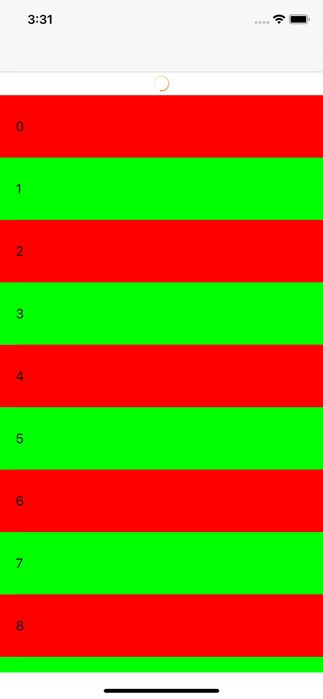

# Refresh
基于`UIScrollView`的简易分页刷新UI<br/>

# Installation
支持Swift Package Manager
# Usage

```
weak var ws = self
tableView.header = RefreshHeader({
    ws?.doSomeWorkd {
        ws?.count = 10
        ws?.tableView.reloadData()
        ws?.tableView.header?.endRefreshing()
    }
})

tableView.footer = RefreshFooter({
    ws?.doSomeWorkd {
        ws?.count += 10
        ws?.tableView.reloadData()
        ws?.tableView.footer?.endRefreshing()

    }
})
tableView.header?.beginRefreshing()
```
在`UITablView、UICollectionView`的使用场景中，如果元素个数为0或者分页请求之后没有更多数据，建议隐藏footer
```
tableView.footer?.isHidden = count == 0
```
